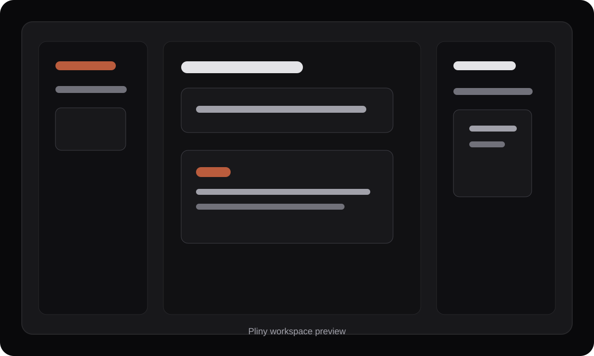
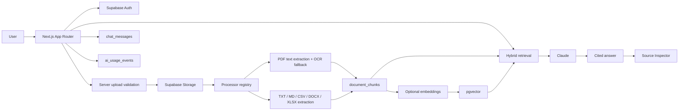

# Pliny AI

Product mark: `pliny.ai`

From complex documents to verifiable decisions.

Private document intelligence with traceable answers, source-backed analysis and decision-ready reports.

Ask questions across private work files and verify answers with source passages.



Live demo: pending deployment.

## Verification

Run the credential-free unit/contract and mocked-integration evaluation suite with:

```bash
npm run eval
```

The report separates unit/contract, mocked integration, and live end-to-end checks. Live tests are not run by default and require a real `.env.local` with the project’s configured Supabase, Voyage, Anthropic, and rate-limit services. Do not commit `.env.local` or place credentials in fixtures.

For the full manual live workflow, use: create workspace → upload documents → process and index → ask a supported question → inspect its exact citation → ask an unsupported question → verify the structured refusal → generate the Risk and Evidence Report → print/export it.

## What It Does

Pliny AI is a private document-intelligence workspace. Users create workspaces, upload supported files, process text into searchable chunks, ask questions, inspect cited evidence, and generate decision-ready reports.

## Built With

- Next.js 15 App Router
- React 19
- TypeScript
- Tailwind CSS
- shadcn-style UI primitives
- Supabase Auth
- Supabase Postgres
- Supabase Storage
- Anthropic Claude
- Voyage AI embeddings
- Zod
- React Hook Form
- pdf-parse
- mammoth DOCX extraction
- Tesseract OCR fallback
- Upstash Redis rate limiting

## Architecture



## Core Flow

```text
Sign in -> Create project -> Upload supported file -> Process text -> Optional embeddings -> Ask question -> Retrieve chunks -> Answer with sources
```

1. Supabase Auth protects dashboard and project routes.
2. Uploads go through a server route that validates ownership, file size, extension, MIME type, and format-specific safety checks before writing to Storage.
3. Processing uses a plugin registry. Active processors support PDF, DOCX, XLSX, CSV, Markdown, and TXT.
4. PDF processing extracts selectable text first, then tries a bounded OCR fallback for low-text documents.
5. Text is split into chunks with location metadata and saved in `document_chunks`.
6. When embeddings are enabled, Voyage chunk embeddings are stored in Supabase Postgres with pgvector.
7. Questions retrieve relevant chunks before Claude is called. Retrieval falls back to keyword search when embeddings are disabled or unavailable.
8. Claude is instructed to answer only from retrieved excerpts and cite source indexes as `[[s.X]]`.
9. Citations open the matching source in the Source Inspector.
10. Chat messages and AI usage events are saved for continuity and auditability.

## Security Posture

- `.env.local` and local environment files are ignored by git.
- API routes check `auth.getUser()` before database, storage, processing, or model work.
- Project and document ownership checks are performed before protected reads or writes.
- Supabase RLS policies scope rows by user ownership and collection/document relationships.
- Storage policies scope access to paths beginning with the authenticated user id.
- Upload validation runs on the server before document rows are created.
- AI requests are guarded by a kill switch, route rate limits, daily request limits, prompt-size limits, chunk caps, model routing, token caps, and `maxRetries: 0`.
- Usage is logged to `ai_usage_events`.
- Security headers are configured in `next.config.ts`, including report-only CSP for first deployment testing.
- Model output is rendered through controlled React text and citation components, not raw HTML.

Mitigations are aligned with OWASP Top 10 for LLM Applications 2025:

- LLM01 Prompt Injection: retrieved chunks are wrapped in source delimiters and treated as evidence, not instructions.
- LLM02 Sensitive Information Disclosure: credentials and private operational details are not placed in the system prompt.
- LLM05 Improper Output Handling: model output is rendered through controlled React text/citation components, not raw HTML.
- LLM07 System Prompt Leakage: prompts are written assuming they may be visible to users.
- LLM10 Unbounded Consumption: AI requests are limited by rate, token, model, and daily budget guardrails.

## Current Limitations

- Retrieval supports keyword search by default. Semantic hybrid retrieval is available when embeddings and pgvector schema are enabled.
- If embeddings are disabled or unavailable, the app falls back to keyword and broad-context retrieval.
- Active ingestion currently supports PDF, DOCX, XLSX, CSV, Markdown, and TXT. PPTX, code files, and IPYNB are not supported.
- OCR is bounded for CPU safety and may not recover enough text from poor scans.
- RLS verification SQL is included, but cross-user tests must be run manually before a public launch.
- CSP is report-only and should be tightened after preview testing.
- Production rate limits require Upstash Redis environment variables.
- Billing, team accounts, SSO, and deployment automation are not included.

## Local Setup

Install dependencies:

```bash
npm install
```

Copy environment variables:

```bash
cp .env.local.example .env.local
```

Fill `.env.local` locally. Do not commit it.

Run the dev server:

```bash
npm run dev
```

Open [http://localhost:3000](http://localhost:3000).

## Environment Variables

```bash
NEXT_PUBLIC_SUPABASE_URL=
NEXT_PUBLIC_SUPABASE_ANON_KEY=
ANTHROPIC_API_KEY=
VOYAGE_API_KEY=
AI_ENABLED=true
ANTHROPIC_DEFAULT_MODEL=claude-haiku-4-5
ANTHROPIC_STRONG_MODEL=claude-sonnet-4-6
AI_MAX_OUTPUT_TOKENS=700
AI_MAX_CHUNKS=4
AI_MAX_CHARS_PER_CHUNK=900
AI_MAX_REQUESTS_PER_MINUTE=3
AI_MAX_REQUESTS_PER_DAY=20
AI_DAILY_BUDGET_INR=30
# Keyword retrieval works without embeddings. Set this to true only when VOYAGE_API_KEY is configured.
EMBEDDINGS_ENABLED=false
EMBEDDINGS_PROVIDER=voyage
EMBEDDING_MODEL=voyage-4
EMBEDDING_DIMENSIONS=1024
EMBEDDING_BATCH_SIZE=10
EMBEDDING_MAX_CHUNKS_PER_DOCUMENT=200
EMBEDDING_QUERY_MAX_CHARS=2000
OCR_ENABLED=true
OCR_MAX_PAGES=5
UPSTASH_REDIS_REST_URL=
UPSTASH_REDIS_REST_TOKEN=
UPLOAD_MAX_REQUESTS_PER_HOUR=5
PROCESS_MAX_REQUESTS_PER_HOUR=5
SUPABASE_SERVICE_ROLE_KEY=
```

## Supabase Setup

Run the SQL in `src/lib/supabase/schema.sql` in the Supabase SQL Editor. The schema includes projects, documents, chunks, chat messages, AI usage events, row-level security policies, and private Storage policies for the `documents` bucket.

Then run `src/lib/supabase/rls-verification.sql` and manually test cross-user access before making the project public.

## Scripts

```bash
npm run dev
npm run lint
npx tsc --noEmit
npm run build
npm run backfill:embeddings
npm audit --omit=dev
```

## Deployment Notes

Before deploying:

1. Configure Supabase Auth Site URL and redirect URLs for localhost, preview deployments, and the production domain.
2. Add production environment variables in the hosting provider.
3. Configure Upstash Redis environment variables for production rate limits.
4. Run the RLS verification SQL and manual cross-user tests.
5. Enable GitHub Push Protection.
6. Review CSP reports before moving from report-only to enforced CSP.
7. Run a secret scanner such as gitleaks or trufflehog before making the repository public.
