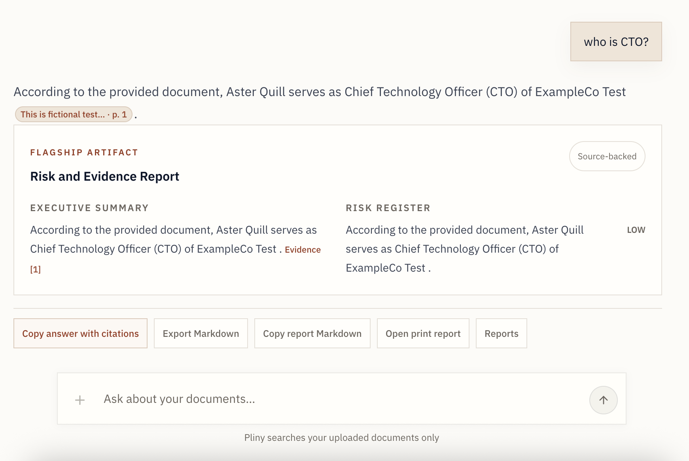
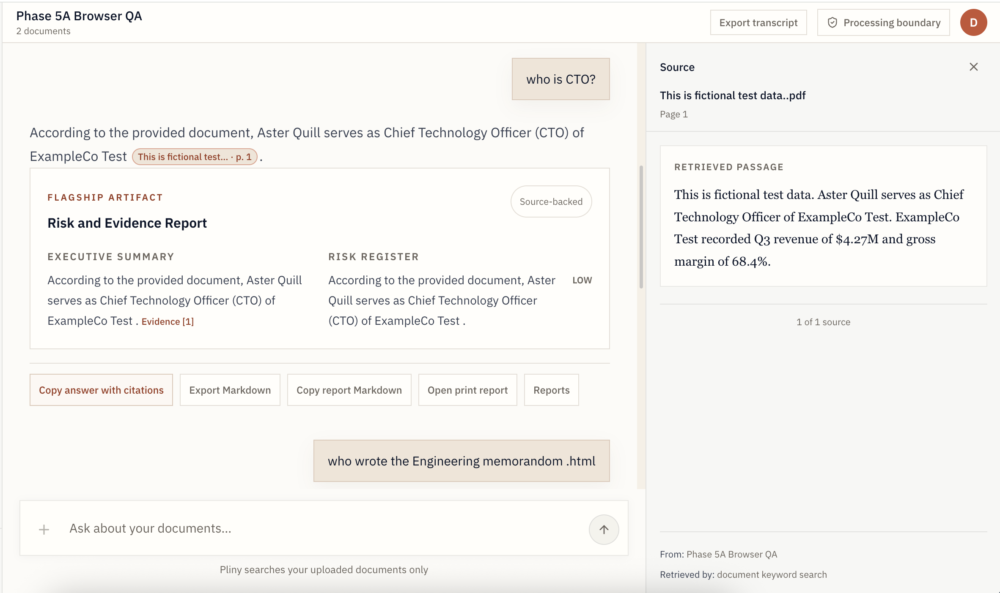
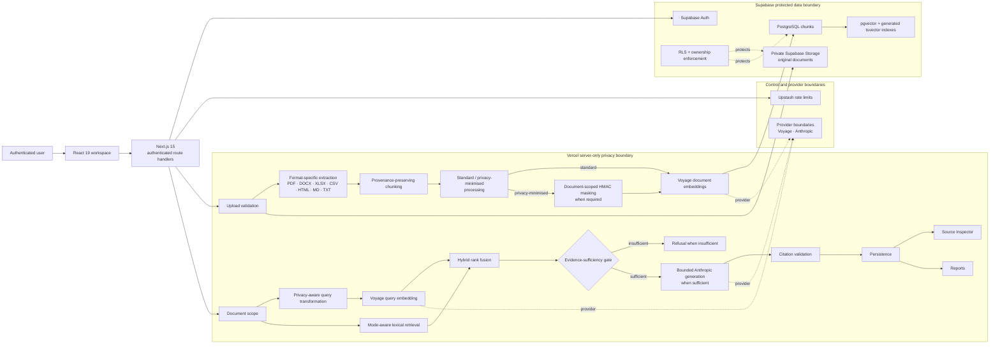
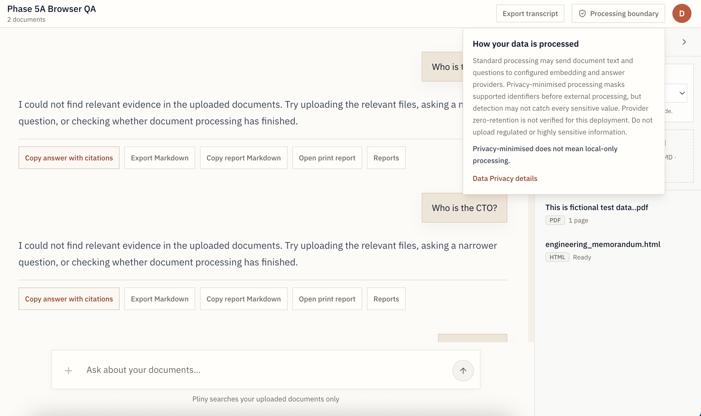

  

# Pliny

## Knowledge, traced to its source.

Pliny is a private, source-grounded document intelligence workspace with verifiable citations and privacy-minimised external processing. It turns mixed-format work files into searchable evidence, refuses unsupported answers, and keeps every accepted claim connected to the passage that supports it.

[Live Product](https://pliny.vercel.app) · [Architecture](./docs/architecture.md) · [Security & Privacy](./docs/security-and-privacy.md) · [Evaluation](./docs/evaluation.md)

*A synthetic CTO question answered with a citation anchored to the owner-visible source.*

## The problem

Document tools often make fluent answers easier to produce than trustworthy decisions. Relevant passages can be buried across PDFs, spreadsheets and working notes; retrieval can disagree across search paths; and an answer without resolvable provenance is difficult to review.

Pliny treats evidence as the product boundary. Retrieval happens before generation, weak context is rejected, and citations resolve back to owner-visible source material.

## What makes Pliny different

- **Evidence before generation.** Lexical and semantic candidates are fused, bounded and checked for sufficiency before an answer provider is called.
- **Citations that resolve.** Source markers are parsed and validated against the exact retrieved chunks; the Source Inspector opens the corresponding filename, location and excerpt.
- **Privacy is a processing mode, not a slogan.** Privacy-minimised documents receive document-scoped HMAC pseudonyms and separate provider-safe content and metadata projections.
- **Failure is explicit.** Missing evidence, incomplete masked projections, provider failures and budget failures stop or degrade safely instead of producing unsupported certainty.
- **Operational controls are part of the system.** Private object storage, tenant-scoped database policies, rate and cost limits, safe logging and guarded storage reconciliation are implemented boundaries.

*The Source Inspector resolves the citation to the fictional PDF, page 1 and the exact retrieved passage.*

## Product capabilities

- Authenticated, owner-scoped workspaces
- Sequential batch upload for one to five files with per-file status
- Native multi-format extraction with bounded PDF OCR fallback
- Provenance-preserving chunks for pages, headings, rows, sheets and text blocks
- Hybrid PostgreSQL lexical search and 1,024-dimension semantic retrieval
- Bounded acronym/title equivalence for supported retrieval concepts
- Evidence-sufficiency refusal before external answer generation
- Validated inline citations and an exact-source inspector
- Source-grounded charts, Risk and Evidence Reports, Markdown exports and print output
- Standard and privacy-minimised processing modes captured immutably per document

## Architecture

Pliny uses a React 19 interface and Next.js 15 App Router on Vercel. Supabase provides authentication, private object storage and PostgreSQL with pgvector, generated lexical indexes, row-level security and explicit role grants. Server-side ingestion selects a processor by file type, normalises provenance, creates bounded chunks and builds either original or provider-safe retrieval material.

At query time, Pliny resolves document scope and the strictest participating privacy boundary, runs lexical and semantic retrieval, fuses and validates the evidence, and only then constructs a bounded generation envelope. Voyage currently supplies embeddings and Anthropic currently supplies answer generation; both sit behind replaceable server-side provider boundaries rather than defining the product architecture.

The [complete architecture](./docs/architecture.md) contains the complete system topology, 23-stage ingestion lifecycle, 30-stage query-to-answer lifecycle, and privacy/security/failure boundaries.

## Security and privacy posture

- Supabase Auth gates workspaces and protected routes.
- Row-level security and ownership predicates isolate collections, documents, chunks, messages and usage records.
- Anonymous DML grants are revoked from private application tables.
- Original files live in a private Storage bucket under owner-prefixed exact paths.
- Privacy-minimised processing masks supported deterministic identifiers before embedding and answer-provider requests.
- Provider payloads are bounded and asserted against detected original identifiers in privacy-minimised mode.
- Server logs use safe stage metadata rather than document passages or provider bodies.
- Browser bundles are scanned for server-only secret names and provider-key indicators.
- Rate limits and persistent daily request/cost checks fail closed in Production when their backing controls are unavailable.
- Storage reconciliation requires repeated orphan witnesses, signed manifests and exact-path deletion.

*The Processing boundary control keeps external-processing limits visible without a permanent warning banner.*

Privacy-minimised processing is not local-only processing. Detection can miss sensitive values, and provider zero-retention has not been verified for this deployment. See the [full security and privacy posture](./docs/security-and-privacy.md).

## Verified engineering evidence

| Evidence | Current witness |
| --- | --- |
| Offline behavior evaluation | 14/14 automated cases passed |
| Privacy/database acceptance | 59/59 pgTAP assertions passed on two clean rebuilds |
| Tenant and API boundary | Anonymous database DML denied; protected Production APIs reject unauthenticated requests |
| Retrieval | Hybrid, lexical-only, semantic-only, scoped and fail-closed paths covered deterministically |
| Citations | Marker validation, multi-document coverage and Source Inspector resolution verified |
| Ingestion | PDF, DOCX, XLSX, CSV, HTML, Markdown and TXT processors covered |
| Privacy boundary | Mock provider payload assertions and Production browser-bundle secret scans passed |
| Production acceptance | Multi-file upload, safe Markdown rendering and acronym/title retrieval defects accepted in the real interface |
| Build quality | ESLint, TypeScript and the Next.js Production build passed at the released commit |

The [evaluation record](./docs/evaluation.md) separates deterministic evidence from provider-backed and browser acceptance.

## Supported formats

| Format | Implemented handling |
| --- | --- |
| PDF | Native text extraction with bounded per-page OCR fallback |
| DOCX | Paragraph extraction with layout caveats |
| XLSX | Sheet, row, header and cell-aware extraction |
| CSV | Structured row batches with source ranges |
| HTML | Safe visible-text and structural block extraction |
| Markdown | Headings, lists, code and text blocks |
| TXT | Bounded line-oriented text extraction |

Legacy `.xls`, macro-enabled spreadsheets, presentations, notebooks and arbitrary code files are not accepted.

## Current limitations

- Deterministic identifier detection is intentionally bounded and can miss sensitive values.
- External processors receive original or masked content depending on the document mode; this is not a local-only system.
- Provider account-level zero-retention remains unverified.
- Poor scans may exceed the bounded OCR path.
- Provider-backed quality evaluation is still limited relative to the deterministic suite.
- GLM is planned but not implemented; Anthropic remains the current answer provider.
- Team roles, SSO and billing are not implemented.
- A moderate transitive `@xmldom/xmldom` advisory remains open.

See [current limitations](./docs/limitations.md) for the precise boundaries.
