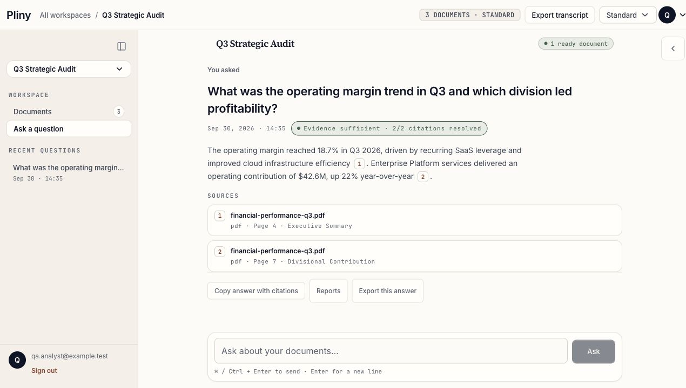
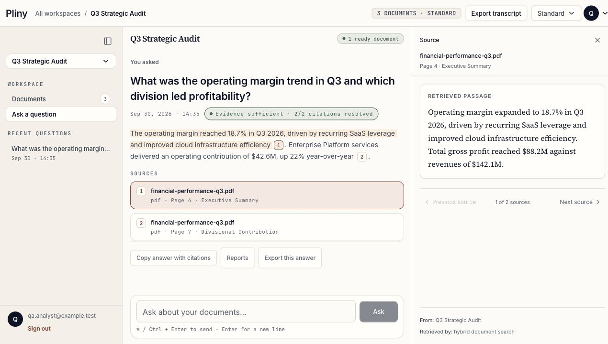
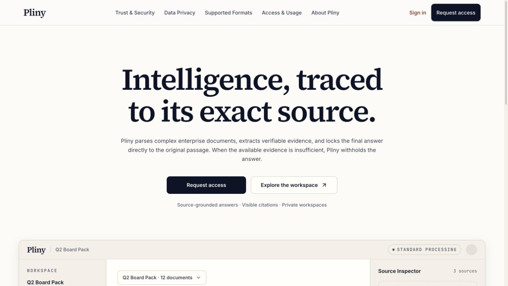
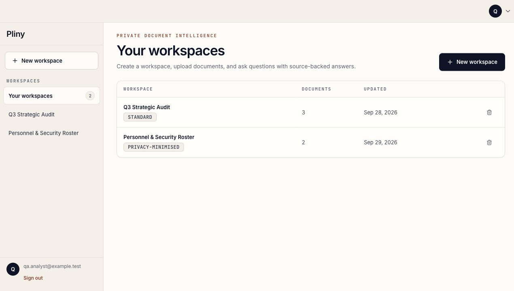
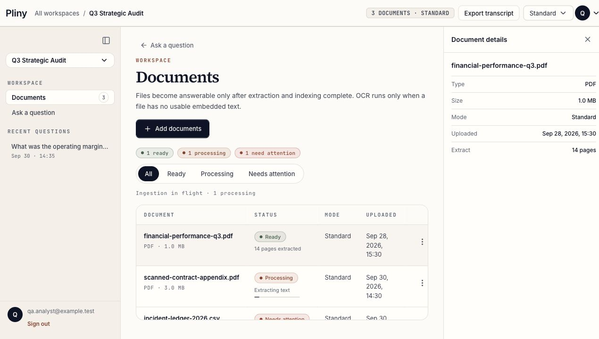
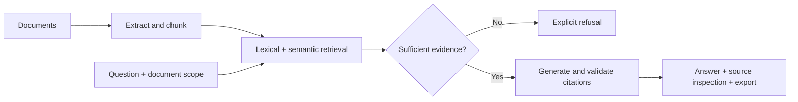

# Pliny

### Intelligence, traced to its exact source.

Pliny is a document-intelligence workspace for reviewing PDFs, spreadsheets and working notes. Upload documents, ask a question, and inspect the passages behind the answer—without losing the question, the source or the conversation.

[Explore Pliny](https://pliny.vercel.app/) · [Architecture](./docs/architecture.md) · [Security & Privacy](./docs/security-and-privacy.md) · [Evaluation](./docs/evaluation.md)

*Current application components with illustrative sample records. Screenshots captured October 10, 2026; not live answer-quality measurements.*

## From documents to reviewable answers

**Organise the evidence.** Keep files in private, owner-scoped workspaces. Follow each document through processing, Ready or Needs attention states; review details, retry processing and delete individual documents.

**Ask within a defined scope.** Search the workspace or selected documents. Questions and answers remain together in a chronological conversation, with recent-question navigation and explicit retry feedback.

**Inspect before trusting.** Inline citations open the Source Inspector with the filename, location and retrieved passage. When available evidence is insufficient, Pliny returns a refusal rather than treating missing information as a fact.

**Take the result with you.** Copy a cited answer, export one answer as Markdown, print/save it as PDF, or export the conversation transcript. Supported answers can also produce evidence-linked charts and a Risk and Evidence Report.

## A citation is the beginning of review

*The selected sample citation connects the answer to a specific PDF passage and page. Source navigation stays beside the conversation.*

## The current interface

Landing page

*Captured from the public product. Its interactive example uses synthetic documents.*

Private workspaces

*Illustrative workspaces show document counts and processing modes without exposing private customer data.*

Document processing and details

*Sample Ready, Processing and Needs attention states demonstrate how ingestion progress and document details are presented.*

## Engineering behind the interface

- **Format-aware ingestion:** PDF, DOCX, XLSX, CSV, HTML, Markdown and TXT processors preserve available page, heading, sheet and row locations. Scanned PDFs have a bounded OCR fallback.
- **Hybrid retrieval:** PostgreSQL full-text search and pgvector semantic search feed reciprocal rank fusion, with additional handling for exact structured identifiers. The lexical lane is PostgreSQL full-text search, not BM25.
- **Answer boundaries:** Evidence-sufficiency checks and citation validation constrain the answer path. Refusals, provider failures and rate limits are represented explicitly in the interface.
- **Privacy-minimised processing:** Supported identifiers receive document-scoped pseudonyms before external processing. Standard and privacy-minimised modes are recorded per document.
- **Ownership controls:** Authentication, row-level security, private object storage and server-side ownership checks protect workspace data.
- **Regression coverage:** Deterministic tests, release evaluations and focused browser checks cover ingestion, retrieval, citations, privacy boundaries and key interface flows. See the evaluation record for the scope and limitations of each result.

```mermaid
flowchart LR
    Files["Documents"] --> Ingest["Extract and chunk"]
    Ingest --> Search["Lexical + semantic retrieval"]
    Question["Question + document scope"] --> Search
    Search --> Gate{"Sufficient evidence?"}
    Gate -->|No| Refuse["Explicit refusal"]
    Gate -->|Yes| Answer["Generate and validate citations"]
    Answer --> Review["Answer + source inspection + export"]
```

Built with **TypeScript, Next.js, React, PostgreSQL/pgvector and Tesseract**, with authentication and private storage supplied by Supabase. The [architecture guide](./docs/architecture.md) describes the ingestion, retrieval, privacy and failure boundaries in detail.

## Scope and limitations

Pliny is a deployed portfolio product, not an enterprise compliance certification. File size, extraction, indexing and OCR are bounded; large-document capacity is not guaranteed. Team roles, shared workspaces, enterprise SSO and billing are not implemented.

Privacy-minimised processing is not local-only processing and can miss sensitive values. A citation identifies the supporting passage; it does not guarantee that the document itself is correct or complete. See [current limitations](./docs/limitations.md) and [Security & Privacy](./docs/security-and-privacy.md) before evaluating it with sensitive documents.
