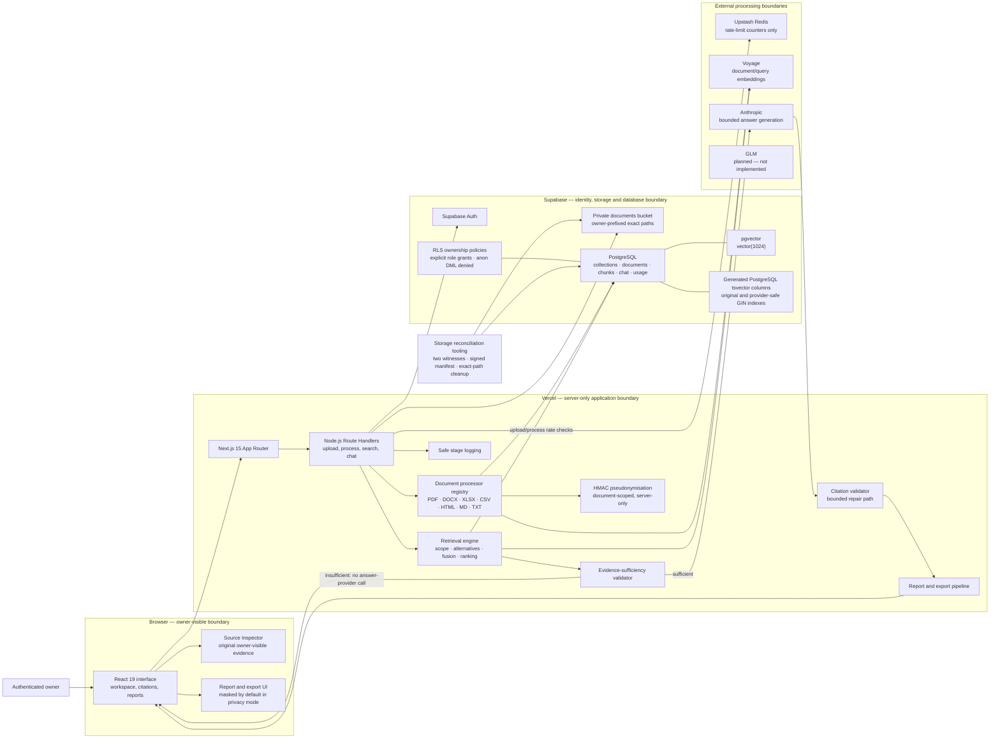
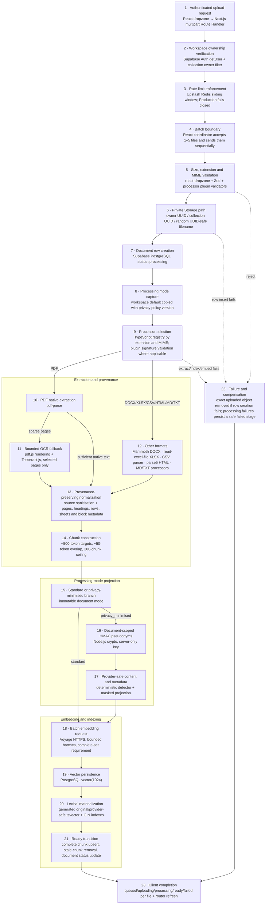
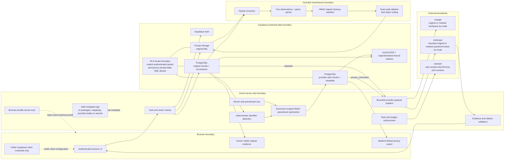

# Pliny architecture

Pliny is a private, source-grounded document intelligence workspace. This document describes the implemented system at release commit `8987e383c563a2b054507e50110317e32995f356`; planned components are marked explicitly.

The provider integrations are replaceable boundaries. Voyage is the current embedding processor and Anthropic is the current answer processor. GLM is planned, not implemented.

## View 1 — System topology

Application code runs in the Vercel-hosted Next.js runtime. Browser code can hold the public Supabase client credential, but server-only provider credentials and the pseudonym key remain outside the client bundle. Supabase RLS and explicit grants remain authoritative even when application ownership filters are also present.

## View 2 — Document ingestion lifecycle

Important implementation details:

- The browser coordinates the bounded batch; each file still crosses the authenticated server boundary independently, so partial success is visible and no file is silently discarded.
- Processor-specific ceilings are stricter than the outer 15 MB upload ceiling where appropriate: HTML, Markdown and TXT are 5 MB; CSV is 10 MB; PDF, DOCX and XLSX are 15 MB.
- Native PDF extraction is preferred. OCR runs only when enabled and only for sparse pages, with a bounded page count.
- Chunks retain source location metadata. Standard chunks use original text for embedding; privacy-minimised chunks use provider-safe text and mark the embedding projection accordingly.
- Embedding is all-or-fail for the current document. A document is not marked ready with a partial vector set.
- PostgreSQL generates lexical material from stored columns. Privacy retrieval excludes original filenames from its provider-safe lexical weighting.
- Deleting an application row is not represented here as automatic Storage cleanup. Separate reconciliation tooling detects and controls orphan removal.

## View 3 — Query-to-answer lifecycle

```mermaid
flowchart TB
  Q1["1 · Authenticated chat request<br/>Next.js Node.js Route Handler + Zod"]
  Q2["2 · Owner/workspace verification<br/>Supabase Auth + owner-filtered collection lookup"]
  Q3["3 · Request and daily budget boundaries<br/>persistent ai_usage_events + minute/day/cost limits"]
  Q4["4 · Document scope resolution<br/>inventory, filename and cross-document intent"]
  Q5["5 · Participating document modes<br/>ready owner-scoped documents"]
  Q6["6 · Strictest boundary<br/>any privacy-minimised document makes the request privacy-minimised"]
  Q7["7 · Query normalization"]
  Q8["8 · Stop-word treatment"]
  Q9["9 · Bounded acronym/title alternatives<br/>deterministic known-role mapping"]
  Q10["10 · Document-scoped privacy query transform<br/>HMAC pseudonyms when required"]
  Q11["11 · Vector query embedding<br/>Voyage, transformed query in privacy mode"]
  Q12["12 · Mode-aware lexical RPC<br/>original or provider-safe generated tsvector"]
  Q13["13 · Semantic retrieval<br/>pgvector cosine RPC, collection/document/owner scoped"]
  Q14["14 · Lexical retrieval<br/>PostgreSQL websearch_to_tsquery + GIN"]
  Q15["15 · Rank fusion<br/>normalized 55% semantic · 35% lexical · 10% deterministic boost"]
  Q16["16 · RLS and ownership enforcement<br/>authenticated grants + auth.uid predicates"]
  Q17["17 · Retrieval reason<br/>hybrid / semantic / direct lexical / broad fallback / empty"]
  Q18["18 · Broad-context fallback<br/>visible as weak context, never sufficient by itself"]
  Q19["19 · Evidence sufficiency<br/>bounded size, lexical/semantic support, document coverage"]
  Refusal["20 · Structured refusal<br/>no answer-provider call; reason + closest matches"]
  Q21["21 · Bounded source envelope<br/>selected chunks clamped by count and characters"]
  Q22["22 · Privacy payload assertion<br/>detected originals forbidden when privacy-minimised"]
  Q23["23 · Answer generation<br/>Anthropic today; replaceable provider boundary"]
  Q24["24 · Citation parsing<br/>[[s.X]] and page markers"]
  Q25["25 · Citation validation<br/>resolvable source IDs, chart refs and document coverage"]
  Q26["26 · Bounded citation repair<br/>one additional Anthropic call only when eligible; same masked context in privacy mode"]
  Q27["27 · Persistence<br/>question, answer, citations and usage in PostgreSQL"]
  Q28["28 · Safe Markdown rendering<br/>tokenized React elements, no raw model HTML"]
  Q29["29 · Source Inspector<br/>citation → exact owner-visible filename, location and excerpt"]
  Q30["30 · Report/export<br/>grounded report, Markdown/print; masked default in privacy mode"]
  GLM["GLM generation<br/>planned — not implemented"]

  Q1 --> Q2 --> Q4 --> Q5 --> Q6 --> Q7 --> Q8 --> Q9 --> Q10
  Q10 --> Q11 --> Q13
  Q10 --> Q12 --> Q14
  Q13 --> Q15
  Q14 --> Q15 --> Q16 --> Q17 --> Q18 --> Q19
  Q19 -->|"insufficient"| Refusal --> Q27
  Q19 -->|"sufficient"| Q3
  Q3 -->|"blocked"| Refusal
  Q3 -->|"allowed"| Q21 --> Q22 --> Q23 --> Q24 --> Q25
  Q25 -->|"valid"| Q27
  Q25 -->|"repair eligible"| Q26 --> Q25
  Q25 -->|"invalid after repair"| Refusal
  Q27 --> Q28 --> Q29 --> Q30
  GLM -. "future provider option" .-> Q23
```

The diagram preserves the implemented execution order even where a numbered requirement is checked later: answer-provider minute, daily and cost budgets are evaluated after evidence sufficiency so refused questions do not consume an Anthropic budget. The refusal branch does not call Anthropic. Query embeddings can still have occurred before evidence sufficiency is decided when semantic retrieval is enabled. Privacy-minimised requests transform both retrieval queries and generation context; a missing required masked projection fails closed.

## View 4 — Privacy, security and failure boundaries

### Data-boundary table

| Data class | Stored where | Sent externally | Browser-visible | Protection |
| --- | --- | --- | --- | --- |
| Authentication/session state | Supabase Auth and secure session cookies | Supabase Auth | Session-dependent UI state | Auth checks, cookie handling, protected-route middleware |
| Original files | Private Supabase `documents` bucket | Not sent as whole files to embedding or answer providers | Owner can access through authenticated flows | Private bucket, owner-prefixed Storage policies, exact paths |
| Original chunks and provenance | Supabase PostgreSQL | Standard mode sends bounded chunk text to Voyage and selected source envelopes to Anthropic | Owner-visible through citations and Source Inspector | RLS, explicit grants, collection/document/user predicates |
| Provider-safe projections | Supabase PostgreSQL beside original chunks | Privacy-minimised mode sends masked text/metadata to Voyage and Anthropic | Masked exports; original evidence remains owner-resolvable | Document-scoped HMAC tokens, separate generated lexical index, payload assertions |
| Embedding vectors | PostgreSQL `vector(1024)` | Voyage returns vectors; query vectors are transient in the request path | Not directly exposed in product UI | Scoped RPCs, RLS ownership boundaries, bounded dimensions |
| Questions and answers | Supabase PostgreSQL chat records | Standard mode may send original question; privacy mode sends transformed question. Anthropic returns generated text. | Owner-visible chat; masked fields drive privacy exports | RLS, mode-aware fields, safe rendering, citation validation |
| Citations and report material | Chat citation JSON and client-generated report structures | Citation repair may resend the same bounded context; masked in privacy mode | Owner-visible source resolution and exports | Resolvable chunk/document IDs, citation validation, bounded repair |
| Rate-limit state | Upstash Redis | Authenticated user UUID as the upload/process rate-limit identifier, plus counter/window metadata | Not shown directly | Sliding windows; no document text or question content intentionally supplied |
| Usage/cost records | Supabase PostgreSQL `ai_usage_events` | Not intentionally sent beyond data platform | Indirectly reflected in blocked/allowed responses | RLS, persistent per-user daily checks |
| Pseudonym key and mappings | Key exists only in the server runtime; no reversible mapping table is stored | Never intentionally sent | Never browser-visible | Server-only secret, HMAC derivation, bundle scanning, safe logs |
| Operational logs | Vercel/runtime logging | Vercel logging boundary | Not product-visible | Safe stage/category metadata; provider bodies, passages, mappings and secrets excluded by design |
| Cleanup evidence | Local ignored reconciliation artifact directory | Supabase inventory reads; deletion only after approval workflow | Not product-visible | Project/bucket pinning, two witnesses, grace period, signed manifest, exact-path validation, batch ceiling |

### Failure-closed behavior

- Unauthenticated protected requests stop before database, file-processing or provider work.
- Missing Production rate-limit or budget backing blocks the guarded operation.
- Missing privacy projections, detected original identifiers in a privacy payload, or unknown pseudonyms reject the provider boundary.
- Incomplete embeddings prevent the document from entering `ready` state.
- Broad or empty retrieval produces a structured refusal without answer generation.
- Invalid citations are repaired only within a bounded path; unresolved validation falls back to insufficient evidence.
- Cleanup refuses wrong project or bucket identity, unsigned or altered manifests, broad paths, missing second witnesses, insufficient age and oversized deletion batches.

These controls reduce risk; they do not establish zero retention, local-only processing, complete identifier detection, regulatory compliance or elimination of every hallucination.
